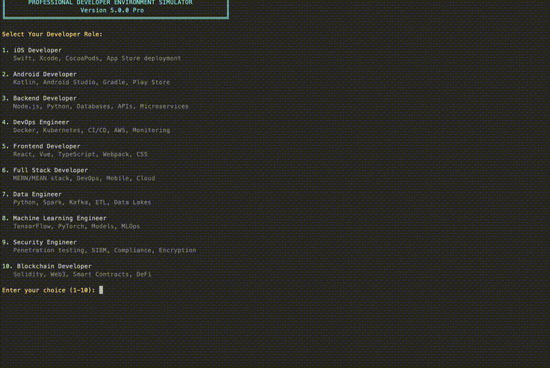

# Professional Developer Simulator



## English

Ever wanted to look like a coding genius? This terminal-based simulator creates an impressive display of developer activity that'll make any onlooker think you're deep in the matrix of code!

### What is this?

Professional Developer Simulator is a fun Python script that generates realistic-looking developer workflows in your terminal. It's perfect for:
- Creating engaging backgrounds for tech videos or streams
- Impressing friends (or that person looking over your shoulder at the coffee shop)
- Understanding what different types of developers actually do
- Just having fun with a terminal full of colorful, animated text!

### Features

✨ **10 Different Developer Personas** - From iOS to Blockchain, pick your flavor!  
🔄 **Infinite Loop Mode** - Runs continuously for hours (great for long streaming sessions)  
🎨 **Beautiful Terminal Graphics** - Colored text, progress bars, and loading animations  
📊 **Realistic Workflows** - Each role has 15+ unique operations based on real development tasks  
⚡ **Dynamic Content** - Randomized values and timings keep it fresh and believable  

### How to Use

1. Clone this repository:
```bash
git clone https://github.com/JeaSungLEE/Terminal-Developer-Simulation.git
cd Terminal-Developer-Simulation
```

2. Run the simulator:
```bash
python3 pro_dev_simulator.py
```

3. Choose your developer role from the menu
4. Sit back and watch the magic happen! (Press Ctrl+C to stop)

### Available Developer Roles

1. **iOS Developer** - Watch Xcode builds, Swift compilation, TestFlight deployments, and App Store submissions
2. **Android Developer** - Experience Gradle builds, Kotlin compilation, emulator testing, and Play Store uploads
3. **Backend Developer** - See API development, database operations, microservices, and performance optimization
4. **DevOps Engineer** - Monitor CI/CD pipelines, Docker containers, Kubernetes deployments, and infrastructure automation
5. **Frontend Developer** - Observe React development, webpack bundling, responsive design testing, and Lighthouse audits
6. **Full Stack Developer** - A mix of frontend and backend operations
7. **Data Engineer** - Big data processing, ETL pipelines, and data lake management
8. **Machine Learning Engineer** - Model training, hyperparameter tuning, and deployment workflows
9. **Security Engineer** - Penetration testing, vulnerability scanning, and security audits
10. **Blockchain Developer** - Smart contract compilation, gas optimization, and DeFi protocols

### Requirements

- Python 3.6 or higher
- A terminal that supports ANSI color codes (most modern terminals do!)
- No external dependencies - just pure Python! 🐍

### Pro Tips

- Maximize your terminal window for the best effect
- Try different roles to see various development workflows
- Use it during video calls for that "busy developer" look 😎
- Each cycle runs for about 3 hours before repeating

---

## 한국어

코딩 천재처럼 보이고 싶으신가요? 이 터미널 시뮬레이터로 당신도 영화 속 해커처럼 보일 수 있습니다! ㅋㅋㅋ

### 이게 뭐예요?

프로페셔널 개발자 시뮬레이터는 터미널에서 실제 개발자들의 작업 과정을 흉내내는 재미있는 파이썬 스크립트입니다. 이런 분들께 강추해요:
- 유튜브나 스트리밍 배경화면이 필요하신 분
- 카페에서 코딩하는 척 하고 싶으신 분 (우리 모두 해봤잖아요 😏)
- 개발자들이 실제로 뭘 하는지 궁금하신 분
- 그냥 알록달록한 터미널 화면이 좋으신 분!

### 주요 기능

✨ **10가지 개발자 페르소나** - iOS부터 블록체인까지, 원하는 개발자 되기!  
🔄 **무한 반복 모드** - 몇 시간이고 계속 돌아가요 (장시간 방송에 딱!)  
🎨 **예쁜 터미널 그래픽** - 컬러풀한 텍스트, 진행률 표시, 로딩 애니메이션  
📊 **현실적인 작업 흐름** - 각 역할마다 실제 개발 업무 기반 15개 이상의 작업  
⚡ **다이나믹한 내용** - 랜덤 값과 타이밍으로 계속 새로워 보여요  

### 사용 방법

1. 이 저장소를 클론하세요:
```bash
git clone https://github.com/JeaSungLEE/Terminal-Developer-Simulation.git
cd Terminal-Developer-Simulation
```

2. 시뮬레이터 실행:
```bash
python3 pro_dev_simulator.py
```

3. 메뉴에서 원하는 개발자 역할 선택
4. 편안히 앉아서 구경하세요! (멈추려면 Ctrl+C)

### 선택 가능한 개발자 역할

1. **iOS 개발자** - Xcode 빌드, Swift 컴파일, TestFlight 배포, 앱스토어 제출 과정
2. **Android 개발자** - Gradle 빌드, Kotlin 컴파일, 에뮬레이터 테스트, 플레이스토어 업로드
3. **백엔드 개발자** - API 개발, DB 작업, 마이크로서비스, 성능 최적화
4. **DevOps 엔지니어** - CI/CD 파이프라인, Docker, Kubernetes, 인프라 자동화
5. **프론트엔드 개발자** - React 개발, webpack 번들링, 반응형 테스트, Lighthouse 검사
6. **풀스택 개발자** - 프론트엔드와 백엔드 작업 믹스
7. **데이터 엔지니어** - 빅데이터 처리, ETL 파이프라인, 데이터 레이크 관리
8. **머신러닝 엔지니어** - 모델 학습, 하이퍼파라미터 튜닝, 배포 작업
9. **보안 엔지니어** - 침투 테스트, 취약점 스캔, 보안 감사
10. **블록체인 개발자** - 스마트 컨트랙트 컴파일, 가스 최적화, DeFi 프로토콜

### 필요한 것들

- Python 3.6 이상
- ANSI 컬러 코드를 지원하는 터미널 (요즘 터미널은 다 돼요!)
- 외부 라이브러리 필요 없음 - 순수 파이썬! 🐍

### 꿀팁

- 터미널 창을 최대화하면 더 멋져요
- 다양한 역할을 시도해보고 각각의 개발 워크플로우를 구경하세요
- 화상회의 중에 켜두면 "열일하는 개발자"로 보여요 😎
- 각 사이클은 약 3시간 동안 실행된 후 반복됩니다

---

## 中文

想要看起来像个编程大神吗？这个终端模拟器能让你瞬间变身电影里的黑客大佬！

### 这是什么？

专业开发者模拟器是一个有趣的Python脚本，能在终端里模拟真实的开发者工作流程。特别适合：
- 制作技术视频或直播时的炫酷背景
- 在咖啡店里装作很忙的样子（别说你没试过 😏）
- 了解不同类型的开发者到底在做什么
- 或者就是单纯享受满屏幕花花绿绿的代码雨！

### 功能特色

✨ **10种开发者角色** - 从iOS到区块链，任你选择！  
🔄 **无限循环模式** - 可以连续运行几个小时（直播神器）  
🎨 **精美的终端效果** - 彩色文字、进度条、加载动画应有尽有  
📊 **真实的工作流程** - 每个角色都有15种以上基于实际开发的操作  
⚡ **动态内容生成** - 随机数值和时间让画面始终保持新鲜感  

### 使用方法

1. 克隆这个仓库：
```bash
git clone https://github.com/JeaSungLEE/Terminal-Developer-Simulation.git
cd Terminal-Developer-Simulation
```

2. 运行模拟器：
```bash
python3 pro_dev_simulator.py
```

3. 从菜单中选择你想扮演的开发者角色
4. 坐下来欣赏这场代码秀！（按Ctrl+C停止）

### 可选择的开发者角色

1. **iOS开发者** - 体验Xcode构建、Swift编译、TestFlight部署、App Store提交
2. **Android开发者** - 感受Gradle构建、Kotlin编译、模拟器测试、Play商店上传
3. **后端开发者** - 观看API开发、数据库操作、微服务架构、性能优化
4. **DevOps工程师** - 监控CI/CD流水线、Docker容器、Kubernetes部署、基础设施自动化
5. **前端开发者** - 查看React开发、webpack打包、响应式测试、Lighthouse审计
6. **全栈开发者** - 前后端操作的混合体验
7. **数据工程师** - 大数据处理、ETL管道、数据湖管理
8. **机器学习工程师** - 模型训练、超参数调优、部署工作流
9. **安全工程师** - 渗透测试、漏洞扫描、安全审计
10. **区块链开发者** - 智能合约编译、Gas优化、DeFi协议

### 系统要求

- Python 3.6或更高版本
- 支持ANSI颜色代码的终端（现代终端基本都支持）
- 无需外部依赖 - 纯Python实现！🐍

### 使用技巧

- 把终端窗口最大化，效果更震撼
- 尝试不同的角色，体验各种开发工作流
- 视频会议时开着它，让自己看起来超忙的样子 😎
- 每个循环大约运行3小时后重新开始

---

## 日本語

コーディングの天才に見られたいですか？このターミナルシミュレーターで、あなたも映画のハッカーのように見えますよ！

### これは何？

プロフェッショナル開発者シミュレーターは、ターミナルで本物の開発者のワークフローを再現する楽しいPythonスクリプトです。こんな方におすすめ：
- 技術系動画や配信のかっこいい背景が欲しい方
- カフェで仕事してる風を装いたい方（みんなやったことありますよね 😏）
- 開発者が実際に何をしているか知りたい方
- ただ単にカラフルなターミナル画面が好きな方！

### 主な機能

✨ **10種類の開発者ロール** - iOSからブロックチェーンまで、なりたい開発者に！  
🔄 **無限ループモード** - 何時間でも動き続けます（長時間配信に最適）  
🎨 **美しいターミナルグラフィック** - カラフルなテキスト、プログレスバー、ローディングアニメーション  
📊 **リアルなワークフロー** - 各ロールに実際の開発作業に基づく15以上の操作  
⚡ **ダイナミックなコンテンツ** - ランダムな値とタイミングで常に新鮮  

### 使い方

1. このリポジトリをクローン：
```bash
git clone https://github.com/JeaSungLEE/Terminal-Developer-Simulation.git
cd Terminal-Developer-Simulation
```

2. シミュレーターを実行：
```bash
python3 pro_dev_simulator.py
```

3. メニューから開発者ロールを選択
4. あとは座って楽しむだけ！（停止するにはCtrl+C）

### 選べる開発者ロール

1. **iOS開発者** - Xcodeビルド、Swiftコンパイル、TestFlightデプロイ、App Store申請
2. **Android開発者** - Gradleビルド、Kotlinコンパイル、エミュレーターテスト、Playストアアップロード
3. **バックエンド開発者** - API開発、データベース操作、マイクロサービス、パフォーマンス最適化
4. **DevOpsエンジニア** - CI/CDパイプライン、Dockerコンテナ、Kubernetesデプロイ、インフラ自動化
5. **フロントエンド開発者** - React開発、webpackバンドル、レスポンシブテスト、Lighthouse監査
6. **フルスタック開発者** - フロントエンドとバックエンドのミックス
7. **データエンジニア** - ビッグデータ処理、ETLパイプライン、データレイク管理
8. **機械学習エンジニア** - モデル訓練、ハイパーパラメータチューニング、デプロイワークフロー
9. **セキュリティエンジニア** - ペネトレーションテスト、脆弱性スキャン、セキュリティ監査
10. **ブロックチェーン開発者** - スマートコントラクトコンパイル、ガス最適化、DeFiプロトコル

### 必要なもの

- Python 3.6以上
- ANSIカラーコードをサポートするターミナル（最近のターミナルなら大丈夫！）
- 外部依存なし - ピュアPython！🐍

### プロのヒント

- ターミナルウィンドウを最大化すると見栄えが良くなります
- 異なるロールを試して、様々な開発ワークフローを体験しましょう
- ビデオ会議中に使えば「忙しい開発者」に見えます 😎
- 各サイクルは約3時間実行されてから繰り返します

---

## License / 라이선스 / 许可证 / ライセンス

MIT License - Feel free to use this for fun, education, or impressing your friends!